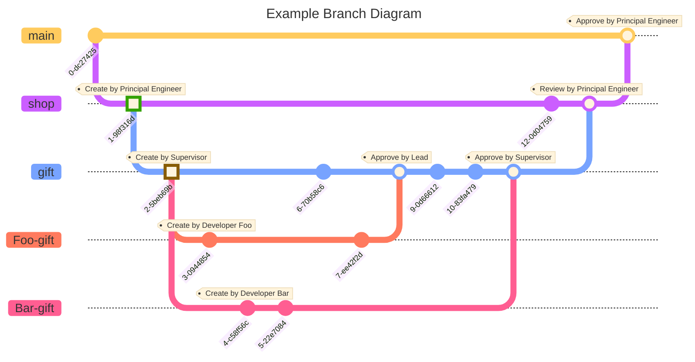

    
<h3>🧭 Get Started</h3>

    <fieldset style="
        width: 500px;
        border: 1px solid #666;
        border-radius: 8px;
        box-shadow: 0 0 10px #666;
        padding-top: 10px;"
    >
        <ul>
            <li><a href="#branching">Branching Instruction</a></li>
            <li><a href="#codespace">Codespace Instruction</a></li>
            <li><a href="#commit">Commit Message Standard</a></li>
            <li><a href="#types-and-emojis">Commit Types and Representative Emojis</a></li>
            <li><a href="#project-structure">Project Structure</a></li>
        </ul>
    </fieldset>

    
<h3>🫚 Branching Instruction</h3>

    <fieldset style="
        width: 100%;
        margin-top:10px;
        border: 1px solid #666;
        border-radius: 8px;
        box-shadow: 0 0 10px #666;
        padding-top: 10px;"
    >
    
<b>Any major working branch should be created with supervision.</b>

    
Create a branch

    <ol>
        <li>Above the repository, click <code># Branches</code> tab next to the <kbd>branch-name ▼</kbd> button.</li>
        <li>Press <kbd>New branch</kbd> at the top-right.</li>
        <li>Type <code>First-Name-branch</code>, all characters must be lowercase with <code>-</code> for spacing, except name is Pascal case. (e.g. Foo-gift)</li>
        <li>Click <kbd>branch-name ▼</kbd> and switch to the <b><i>CORRECT</i></b> working branch.</li>
        <li>Press <kbd>Create new branch</kbd> to create your working branch.</li>
    </ol>
    
Switch between branches

    <ol>
        <li>Click <kbd>branch-name ▼</kbd> under the <code>Demo</code> repository name. (<code>main</code> is default branch)</li>
        <li>Click the branch name to switch the working branch. (e.g. Foo-gift)</li>
    </ol>
    <blockquote>You can also switch branches in your Codespace and VS Code, see the <a href="#codespace">Codespace Instruction</a>.</blockquote>

    
<h3>🔳 Codespace Instruction</h3>

    <fieldset style="
        width: 100%;
        margin-top:10px;
        border: 1px solid #666;
        border-radius: 8px;
        box-shadow: 0 0 10px #666;
        padding-top: 10px;"
    >
    
Create a codespace

    <ol>
        <li>Click <kbd><> Code ▼</kbd> at the top of the repository.</li>
        <li>Switch to the <code>Codespaces</code> tab.</li>
        <li>Click <kbd>Create codespace on main</kbd> or <code>+</code>.</li>
        <li>The container will automatically build for you.</li>
        <blockquote>You can rename the Codespace by clicking the three dots next to the Codespace's name on GitHub.</blockquote>
        <li>Click <code>...</code> next to current codespace.</li>
        <li>Select <code>Open in Visual Studio Code</code> to open the codespace directly in VS Code.</li>
    </ol>
    

        Switch branches.
    

    <ol>
        <li>At the botton-left of the VS Code, click the branch button. (Next to the blue codespace button, default is main)</li>
        <li>Select the working branch from the branches section in the middle of the pop-up menu.</li>
    </ol>
    

        Change directory.
    

    <ol>
        <li>Press <kbd>ctrl</kbd> + <kbd>`</kbd> to open the terminal.</li>
        <li>Type <code>cd demo</code> to change directory to <code>📂 demo</code>.</li>
    </ol>
    

        Delete a codespace.
    

    <ol>
        <li>Click <kbd><> Code ▼</kbd> .</li>
        <li>Click <code>...</code> next to current codespace.</li>
        <li>Select <code>Delete</code> .</li>
    </ol>
    </fieldset>

    
<h3>📤 Commit Message Standard</h3>

    <fieldset style="
        width: 100%;
        margin-top:10px;
        border: 1px solid #666;
        border-radius: 8px;
        box-shadow: 0 0 10px #666;
        padding-top: 10px;"
    >
        
It is <strong><em>Mandatory</em></strong> to use <a href="https://www.conventionalcommits.org/en/v1.0.0/">Conventional Commits</a> when writing the commit message.

        
All characters in the commit message description must be <strong><em>lowercase</em></strong> and written in primitive form (e.g., <strong><em>create</em></strong>, not <s>creates</s> or <s>created</s>), with the following exceptions:
            <ul>
                <li>Dedicated file name (e.g., README).</li>
                <li>Special naming convention, (e.g., Components).</li>
            </ul>
        

        
The commit message description should be concise and end <strong><em>WITHOUT</em></strong> a <kbd>.</kbd> (period).

        <b>Conventional Commits Format</b>
        <pre><code>&lt;emoji&gt; &lt;type&gt;[optional scope]: &lt;description&gt; &lt;pull request id&gt;
        [optional body]
        [optional footer(s)]
        </code></pre>
        <ul>
            <li>
            
General Commit Example:

            <pre>✨ feat: create language dropdown list</pre>
            </li>
            <li>
                
Commit with Pull Request Example:

                <pre>✨ feat(lang): add Spanish to the language dropdown list (#123)</pre>
            </li>
            <li>
                
BREAKING CHANGE (Commit type follow by <code>!</code>) Example:

                <pre>✨ feat!: remove language dropdown list
                The language dropdown list is replaced by an AI bot. 🤖
                ----------
                Co-authored-by: Think Round Admin</pre>
            </li>
        </ul>
        <blockquote>If you still uncertain about the instructions, please watch <a href="https://www.youtube.com/watch?v=OJqUWvmf4gg">this video</a>.</blockquote>
    </fieldset>

    
<h3>🌟 Commit Types and Representative Emojis</h3>

    <fieldset style="
        width: 100%;
        margin-top:10px;
        border: 1px solid #666;
        border-radius: 8px;
        box-shadow: 0 0 10px #666;
        padding-top: 10px;"
    >
        
<b>How to open emoji keyboard?</b>

        

        Window: <kbd>⊞</kbd> + <kbd>.</kbd>
         
        MacOS: <kbd>Control</kbd> + <kbd>⌘</kbd> + <kbd>Space</kbd>
        

        <table>
            <caption>Common Commit Types</caption>
            <thead>
                <tr>
                    <th>Types</th>
                    <th>Description</th>
                    <th>Emoji Name</th>
                </tr>
            </thead>
            <tbody>
                <tr>
                    <th><code>✨ feat:</code></th>
                    <td>Add or remove feature or functionality</td>
                    <td>✨ <code>sparkles</code></td>
                </tr>
                <tr>
                    <th><code>🐛 fix:</code></th>
                    <td>Bug or error fix</td>
                    <td>🐛 <code>bug</code></td>
                </tr>
                <tr>
                    <th><code>📚 docs:</code></th>
                    <td>Documentation changes or updates</td>
                    <td>📚 <code>books</code></td>
                </tr>
                <tr>
                    <th><code>🎨 style:</code></th>
                    <td>Only code style, formatting, or whitespace changes, no actual code changes</td>
                    <td>🎨 <code>artist palette</code></td>
                </tr>
                <tr>
                    <th><code>🔨 refactor:</code></th>
                    <td>Code changes for structural improvement without fixing a bug or adding a feature</td>
                    <td>🔨 <code>hammer</code></td>
                </tr>
                <tr>
                    <th><code>🧹 chore:</code></th>
                    <td>Routine tasks, maintenance, or other miscellaneous changes that don't modify src or test files</td>
                    <td>🧹 <code>broom</code></td>
                </tr>
                <tr>
                    <th><code>🚀 pref:</code></th>
                    <td>Optimizations made to improve the performance of the code</td>
                    <td>🚀 <code>rocket</code></td>
                </tr>
                <tr>
                    <th><code>🧪 test:</code></th>
                    <td>Additions, modifications, or fixes to tests</td>
                    <td>🧪 <code>test tube</code></td>
                </tr>
                <tr>
                    <th><code>🛠️ build:</code></th>
                    <td>Changes that affect the build system or external dependencies (e.g. scope: npm)</td>
                    <td>🛠️ <code>hammer and wrench</code></td>
                </tr>
                <tr>
                    <th><code>⚙️ ci:</code></th>
                    <td>Changes to CI configuration files and scripts</td>
                    <td>⚙️ <code>gear</code></td>
                </tr>
                <tr>
                    <th><code>♻️ revert:</code></th>
                    <td>Revert a previous commit</td>
                    <td>♻️ <code>recycling symbol</code></td>
                </tr>
            </tbody>
        </table>
        <table>
            <caption>Special Commit Types</caption>
            <thead>
                <tr>
                    <th>Types</th>
                    <th>Description</th>
                    <th>Emoji Name</th>
                </tr>
            </thead>
            <tr>
                <th><code>🎉 initial:</code></th>
                <td>Initial commit</td>
                <td>🎉 <code>tada</code> or <code>party popper</code></td>
            </tr>
            <tr>
                <th><code>🔒 Security:</code></th>
                <td>Changes related to security improvements or fixes</td>
                <td>🔒 <code>locked</code></td>
            </tr>
        </table>
    </fieldset>

    
<h3>🗂️ Project Structure</h3>

    <fieldset style="
        width: 100%;
        margin-top:10px;
        border: 1px solid #666;
        border-radius: 8px;
        box-shadow: 0 0 10px #666;
        padding-top: 10px;"
    >
        <pre>
        📂demo
            📂public
                📂assets
                    🖼️banner.png
                    🖼️logo.png
                📂static
                    🖼️gift-1.png
                    🖼️gift-2.png
                    🖼️gift-3.png
                    🖼️merchandise-1.png
                    🖼️merchandise-2.png
                    🖼️merchandise-3.png
            📂src
                📂app
                    📂(client)              //<a href="https://nextjs.org/docs/getting-started/project-structure#route-groups-and-private-folders">Route Groups</a>
                        📂blog
                            📄page.tsx
                        📂product
                            📄page.tsx
                        📂shop
                            📄page.tsx
                    📂(cms)                 //<a href="https://nextjs.org/docs/getting-started/project-structure#route-groups-and-private-folders">Route Groups</a>
                        📂admin
                            📂blog
                                📄page.tsx
                            📂product
                                📄page.tsx
                            📂shop
                                📂gift
                                    📄page.tsx
                                📂merchandise
                                    📄page.tsx
                                📄page.tsx
                        📄page.tsx
                    📂api
                        📄route.tsx
                📂components
                    📂buttons
                        📄Cancel.tsx
                        📄Create.tsx
                        📄Delete.tsx
                        📄Edit.tsx
                        📄Submit.tsx
                    📂client
                        📂blog
                            📄Post.tsx
                        📂product
                            📄Merchandise.tsx
                        📂shop
                            📄Cart.tsx
                    📂homepage
                        📄Header.tsx
                    📂navbar
                        📄Navbar.tsx
                📂utils
                    📂hooks
                        📄useCancel.tsx
                        📄useCreate.tsx
                        📄useDelete.tsx
                        📄useEdit.tsx
                        📄useSubmit.tsx
        </pre>
    </fieldset>

